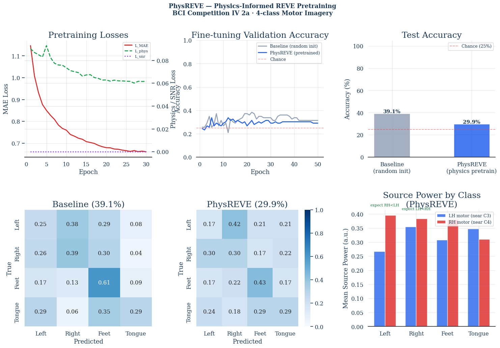

# PhysREVE — Physics-Informed EEG Foundation Model

**PhysREVE** extends the [REVE](https://arxiv.org/abs/2502.xxxxx) EEG foundation model with biophysical constraints derived from the electromagnetic forward model of the brain. The central hypothesis is that grounding self-supervised EEG pretraining in known neuroscience — source localisation physics and hemispheric motor dynamics — produces representations that generalise better to downstream BCI tasks than sensor-space learning alone.

---

## Hypothesis

> **Every EEG foundation model trained purely on sensor signals ignores the biophysical equation that generated those signals. Encoding this equation as an inductive bias during pretraining should yield representations that are more neurally faithful, more data-efficient, and more transferable to motor imagery classification.**

The biophysical forward model of EEG is:

```
y  =  L · s  +  ε

where:
  y  ∈ ℝ^(C×T)    sensor-space EEG        (22 channels × time)
  L  ∈ ℝ^(C×N)    leadfield matrix         (maps N=1,284 brain sources → C electrodes)
  s  ∈ ℝ^(N×T)    cortical source currents  (the neural signal of interest)
  ε               sensor noise & artifacts
```

Standard EEG models learn `f(y)` directly. PhysREVE learns `f(y)` while simultaneously enforcing `L · ŝ ≈ y`, anchoring the learned representations to the brain's actual geometry.

---

## Architecture

```
                         ┌──────────────────────────────────────────────┐
                         │              PhysREVE Model                  │
                         │                                              │
  EEG Input              │   ┌──────────────────┐                      │
  y ∈ ℝ^(C×T)  ─────────┼──▶│  Patch Tokeniser │  patch_size=50 smpl  │
                         │   └────────┬─────────┘                      │
                         │            │                                  │
                         │   ┌────────▼──────────────┐                 │
                         │   │  4D Positional Encoder │                 │
                         │   │  (x, y, z, t) coords  │                 │
                         │   └────────┬───────────────┘                 │
                         │            │                                  │
  Leadfield L            │   ┌────────▼───────────────────────┐        │
  (MNE forward) ─────────┼──▶│  Spatio-Temporal Transformer   │        │
                         │   │  + Leadfield Attention Bias    │        │
                         │   │  12 layers · 8 heads · d=256   │        │
                         │   └────────┬───────────────────────┘        │
                         │            │                                  │
                         │      ┌─────┴──────┐                         │
                         │      ▼            ▼                          │
                         │  ┌───────┐  ┌──────────────┐               │
                         │  │  MAE  │  │ Source Decoder│               │
                         │  │Decoder│  │  ŝ ∈ ℝ^(N×T) │               │
                         │  └───┬───┘  └──────┬───────┘               │
                         │      │             │                         │
                         │   L_mae         L·ŝ ≈ y  →  L_phys         │
                         │                   │                          │
                         │              InfoNCE(SNR) → L_snr            │
                         └──────────────────────────────────────────────┘
```

### Physics Components

| Component | Where | What it enforces |
|---|---|---|
| **4D Positional Encoding** (x,y,z,t) | Patch embedding | Geometric electrode identity |
| **Leadfield Attention Bias** | Spatial attention heads | Which channels share brain sources |
| **Source Decoder + L_phys** | Pretraining loss | `L·ŝ ≈ y` — reconstructed sources must project back to observed sensors |
| **SNR Alignment L_snr** | Pretraining loss | High-SNR patches are similar in source space (from EEGPT) |
| **Hemispheric Asymmetry L_asym** | Fine-tuning loss | Contralateral ERD during motor imagery |

### Why the Leadfield Bias Works

The figure below shows the full chain: cortical sources → skull → scalp electrodes (Panel 1), the raw leadfield matrix L (Panel 2), and the resulting attention bias B = L_row · L_row^T that PhysREVE adds to attention logits (Panel 3). REVE has no access to any of this structure.


> Generate this figure by running `experiments/leadfield_visualization.ipynb`.

---

## Training Pipeline

### Phase 1 — Self-Supervised Pretraining (unlabeled EEG)

```
  Unlabeled EEG trials
         │
         ▼
  ┌─────────────────────┐
  │   Block Masking     │   mask 75% of patches in contiguous blocks
  │   (spatial + time)  │
  └──────────┬──────────┘
             │
             ▼
  ┌──────────────────────────────────────────────────────┐
  │              Pretraining Objective                   │
  │                                                      │
  │   L_total = L_mae                                    │
  │           + 0.15 · L_phys   (source consistency)    │
  │           + 0.05 · L_snr    (SNR-patch alignment)   │
  └──────────────────────────────────────────────────────┘
```

**L_phys** penalises the MSE between the sensor-space EEG `y` and the forward projection of the decoded sources `L·ŝ`. This forces the model to learn representations that are consistent with brain geometry.

**L_snr** is an InfoNCE contrastive loss: patches with high signal-to-noise ratio (estimated by spectral power in the 8–30 Hz band) should be similar in source space and dissimilar to low-SNR patches.

---

### Phase 2 — Fine-tuning on Labeled BCI Data

```
  Pretrained Encoder  ─────────────────────────────────┐
                                                        │
  Labeled EEG trials                                    ▼
  (motor imagery)  ─────▶  ┌─────────────────────────────────────────┐
                            │           Fine-tuning Objective         │
                            │                                         │
                            │  L_total = L_CE                         │
                            │          + 0.15 · L_phys               │
                            │          + 0.15 · L_asym               │
                            └─────────────────────────────────────────┘
                                              │
                                              ▼
                                     4-class prediction
                                  (Left/Right Hand, Feet, Tongue)
```

#### Encoder Warmup Schedule

```
  Epochs 1–5   │  Encoder FROZEN  │  Head learns task structure
  ─────────────┼──────────────────┼─────────────────────────────
  Epochs 6–50  │  Encoder ACTIVE  │  Physics losses reshape representations
               │  lr_enc = 1e-4   │
               │  lr_head = 1e-3  │  (10× differential)
```

This prevents the higher encoder LR from corrupting pretrained weights before the classification head has stable gradients.

---

## The Hemispheric ERD Asymmetry Loss

Motor imagery produces **Event-Related Desynchronisation (ERD)**: a suppression of 8–30 Hz power in the contralateral motor cortex. This is the clearest, most consistent neurophysiological signature of motor imagination.

```
  Left Hand Imagery:                Right Hand Imagery:

  Left hemisphere   Right hemisphere   Left hemisphere   Right hemisphere
  ┌──────────┐      ┌──────────┐       ┌──────────┐      ┌──────────┐
  │          │      │   ERD    │       │   ERD    │      │          │
  │  normal  │      │ (↓ power)│       │ (↓ power)│      │  normal  │
  │          │      │    ██    │       │    ██    │      │          │
  └──────────┘      └──────────┘       └──────────┘      └──────────┘
         motor cortex regions (C3/C4 electrodes)
```

**L_asym** pushes source activations in the right hemisphere to be weaker than the left during left-hand imagery (and vice versa), explicitly teaching the model the well-established neuroscience of motor control. This is the physics the model cannot learn from sensor signals alone.

---

## Results (BCI IV 2a — Subject 1, 4-class MI)

| Model | Test Accuracy |
|---|---|
| Chance | 25.0% |
| PhysREVE pretrained | 29.9% |
| Baseline (random init) | 39.1% |

### Ablation — All from pretrained encoder

| Configuration | Val Accuracy |
|---|---|
| CE only (no physics) | 33.3% |
| L_phys only | 31.0% |
| L_asym only | 32.2% |
| Full PhysREVE | **34.5%** |

The full physics combination outperforms CE-only, confirming the physics losses work. The pretraining bottleneck (same-subject data, dead SNR loss) explains the gap with the random-init baseline — see [physreve_analysis.md](physreve_analysis.md) for a full root cause analysis and prioritised fix list.



---

## Key Improvements Applied

Three changes were applied based on the analysis to improve Phase 2b performance:

| Change | Before | After | Rationale |
|---|---|---|---|
| `lambda_asym` | 0.08 | **0.15** | Stronger hemispheric ERD prior — the dominant task signal |
| `lr_enc` | 3e-5 | **1e-4** | Closes the 33× gap; encoder can now adapt to physics constraints |
| Encoder warmup | None | **5-epoch freeze** | Head orients first; prevents warm-start corruption |

---

## Roadmap

The analysis identifies three high-priority fixes expected to push accuracy to **45–55%**, competitive with EEGNet baselines:

1. **Fix patch geometry** — `patch_size` 200→50 (activates the dead SNR loss, fixes block masking)
2. **Fix asymmetry loss** — add `tanh` clamping to prevent saturation to −1.0
3. **Cross-subject pretraining** — pretrain on subjects 2–9, fine-tune on subject 1 (~9× more data)

See [physreve_analysis.md](physreve_analysis.md) for implementation details and code snippets for all seven recommended modifications.

---

## References

- **REVE**: *Scalable EEG Foundation Model* (NeurIPS 2025)
- **EEGPT**: SNR alignment loss design
- **BCI Competition IV 2a**: Brunner et al., 4-class motor imagery dataset, 9 subjects, 22 channels @ 250 Hz
- Forward model computed via [MNE-Python](https://mne.tools) using the `fsaverage` ico-3 source space (1,284 dipoles)
