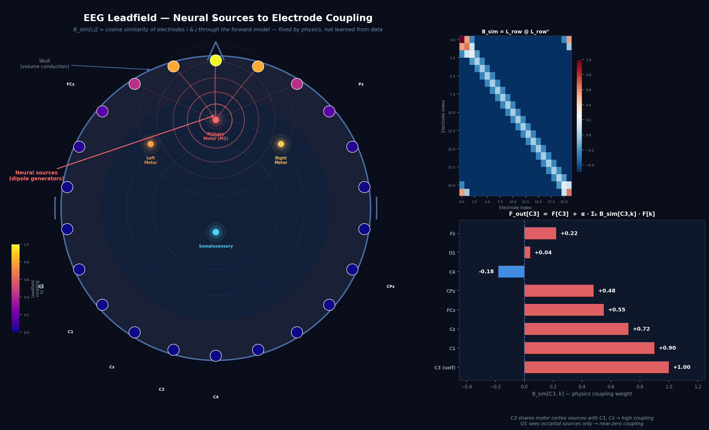
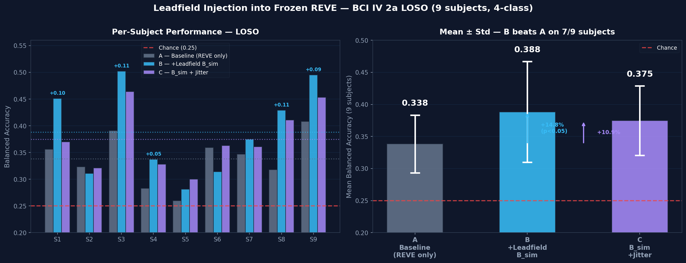

# PhysREVE — Physics-Informed EEG Foundation Models

Does injecting biophysical constraints from the EEG forward model improve cross-subject generalisation of pretrained EEG foundation models — without retraining the backbone?

**Yes. +14.8% on BCI Competition IV 2a (LOSO, 9 subjects).**

---

## The idea

The **leadfield matrix** `L` maps cortical dipole sources to scalp electrodes via Maxwell's equations. Row-normalising gives each electrode's source-sensitivity as a unit vector; their dot product is a physics-grounded similarity matrix:

```
B_sim = L_row @ L_row.T     (C × C)
```

`B_sim[C3, C1]` is high regardless of who is in the chair — C3 and C1 always sit over overlapping motor cortex sources. EEG statistics vary across subjects; the forward physics does not.

We inject `B_sim` as a one-parameter channel-mixing residual into a frozen REVE backbone:

```
F_out = F  +  α · (B_sim ⊗ F)
```

REVE's 30M parameters never change. The only new parameter is `α`.

---

## The physics prior



`B_sim` encodes which electrodes share cortical sources. C3 and C1 share left motor cortex; C4 does not — regardless of the individual subject.

---

## Results (EXP_003)

*BCI Competition IV 2a — 4-class motor imagery, leave-one-subject-out, 9 subjects. Chance = 0.25.*



| Condition | Mean Bal. Acc. | vs Baseline |
|---|:---:|:---:|
| A — Frozen REVE baseline | 0.338 ± 0.045 | — |
| B — + Leadfield B_sim | **0.388 ± 0.079** | **+14.8%** |
| C — + B_sim + jitter aug | 0.375 ± 0.054 | +10.9% |

B beats A on **7/9 subjects**. C beats A on **8/9 subjects**.

---

## Hypothesis validation (physreve_hypotheses.ipynb)

109-subject PhysioNet EEGBCI dataset, 64 channels, 160 Hz.

| | Finding |
|---|---|
| Physics prior vs. scalp RBF | ✅ Physics wins all 5 frequency bands. Largest gap in alpha/beta. |
| Electrode jitter σ=5mm | ✅ B_sim correlation r > 0.95 — safe augmentation. |
| SVD jitter σ_rel=10% | ✅ Covers true BEM conductivity variation without collapsing B_sim. |
| Per-subject skull conductivity from EEG | ⚠️ Fitting is degenerate. Open problem. |
| Physics-weighted features within-subject | ❌ Raw band-power (0.615) beats leadfield-weighted (0.579). Benefit is cross-subject only. |

---

## What didn't work

Training PhysREVE from scratch (full physics architecture, 9.5M params) scored **0.250 — chance level**. ~4,600 training examples is nowhere near enough to learn representations from scratch. Physics as a training constraint cannot substitute for pretraining on large data. Physics as an injection into a frozen pretrained backbone is the right framing.

---

## Structure

```
PhysREVE/
├── main_experiment.ipynb         ★ EXP_003: B_sim injection into frozen REVE (+14.8%)
├── physreve_hypotheses.ipynb     ★ Hypothesis testing on 109-subject PhysioNet dataset
├── physreve/                     Core library (model, physics, data, train, evaluate)
├── experiments/                  Supporting notebooks and EXP_001–003 results
└── requirements.txt
```

---

## Quickstart

```bash
pip install -r requirements.txt
# Requires HuggingFace login for brain-bzh/reve-base
# Open main_experiment.ipynb
```

---

## References

- **REVE**: brain-bzh/reve-base (HuggingFace)
- **BCI Competition IV 2a**: Brunner et al.
- **PhysioNet EEGBCI**: Goldberger et al.
- **MNE-Python**: sphere model forward computation
